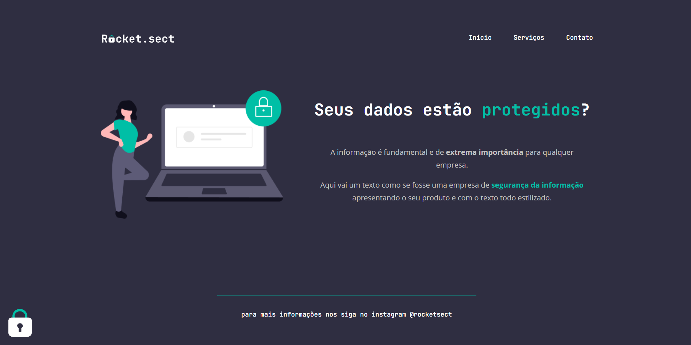

<h1 align="center"> Desafio avançado - Recriando layout</h1>

Programa exclusivo do Bruno Bianchi, para ensino de tecnologias WEB.  
Desafio proposto pela Rocketseat, com objetivo de recriar Layout pronto no Figma. 

  <a href="#-tecnologias">Tecnologias</a>&nbsp;&nbsp;&nbsp;|&nbsp;&nbsp;&nbsp;
  <a href="#-projeto">Projeto</a>

  

 

## 🚀 Tecnologias

Esse projeto foi desenvolvido com as seguintes tecnologias:

- HTML e CSS
- Git e Github

## 💻 Projeto

O Desafio é recriar uma aplicação, a partir de um layout.

- [Acesse o projeto finalizado, online](https://brunobianchi13.github.io/Desafio-avancado-Recriando-layout/)
- [Acesse o Layout no Figma](https://www.figma.com/file/MA9Vm4OmFcIKKiSXwIYDAn/Explorer-(Copy)?node-id=0%3A1&mode=dev)

---

Feito by Bruno Bianchi

